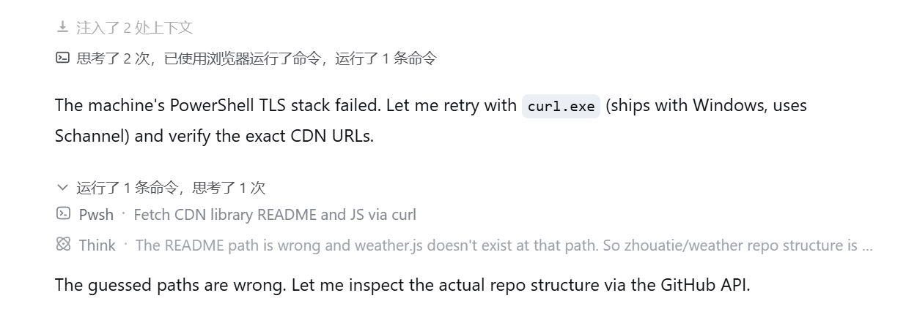
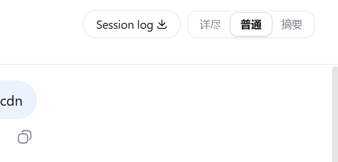
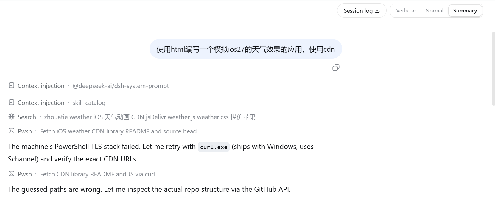

# DshViewModes

<div align="center">

[English](./README.md) · **简体中文**

</div>

<p align="center">为 DSH Web 提供详尽、普通、摘要三种输出模式。排查问题时保留完整轨迹，日常使用时减少过程噪声，只看结果时收起工具调用与思考。</p>

这是一个采用 DSH 官方形态的 bundle 插件（`dsh.bundle` + `dsh.client`）。插件只调整浏览器端展示，不修改 DSH 核心文件。

## 效果预览

普通模式会把相关工具调用和思考合并为语义过程组，同时把正文作为清晰的分界。点击过程标题可以查看原始步骤。

<p align="center">
  
</p>

可以直接在会话标题栏切换三种模式。

<p align="center">
  
</p>

插件文案会跟随 Harness 设置中的语言。切换到 English 后，模式名称、过程标题和工具标签会自动使用英文：

<p align="center">
  
</p>

## 三种模式

| 模式 | 适用场景 | 展示行为 |
|---|---|---|
| **详尽** | 排查问题 | 原样保留 DSH 展示的思考、工具调用、重试、上下文和统计信息 |
| **普通** | 日常使用 | 按语义阶段折叠过程；思考归入相邻过程组；正文始终独立展示，并作为新分组区间的边界 |
| **摘要** | 只关注结果 | 运行时隐藏过程噪声并显示流光状态；完成后把过程收成一条可展开摘要 |

普通模式不会按固定调用数量强制拆组。同一阶段中重复读取多个文件、多次执行命令、连续修改文件、搜索或协调任务，都可以继续聚合；一旦出现可见正文，就会立即结束当前组，正文后的过程从新组开始。

## 安装

环境要求：

- Node.js 20 或更高版本
- DSH 已提供 `web` profile
- Git
- `PATH` 中可以使用 `pnpm`（`dsh plugin` 依赖它；缺少时可执行 `corepack enable`）

### GitHub 公开仓库直装（推荐）

无需 npm 账号：

```sh
dsh plugin --profile web add git+https://github.com/NigelYao/dsh-view-modes.git
```

如果已经安装过旧开发版 `dsh-output-mode`，首次升级时先移除旧包，避免两个 bundle 同时加载：

```sh
dsh plugin --profile web remove dsh-output-mode
dsh plugin --profile web add git+https://github.com/NigelYao/dsh-view-modes.git
```

### Windows 本地开发方式

需要修改源码并立即调试时，建议把仓库克隆到 DSH 用户目录所在盘符，避免跨盘 package link 失效。

```powershell
$pluginRoot = Join-Path $env:USERPROFILE ".dsh\local-plugins\dsh-view-modes"
git clone https://github.com/NigelYao/dsh-view-modes.git $pluginRoot
Set-Location $pluginRoot
dsh plugin --profile web add link:$pluginRoot
```

如果仓库已经位于其他盘符，可以先在 DSH 用户目录创建 junction，再从 junction 安装：

```powershell
$source = "D:\Projects\dsh\plugins\dsh-output-mode"
$pluginRoot = Join-Path $env:USERPROFILE ".dsh\local-plugins\dsh-view-modes"
New-Item -ItemType Junction -Path $pluginRoot -Target $source
Set-Location $pluginRoot
dsh plugin --profile web add link:$pluginRoot
```

不要再在 profile 或用户目录的 `cordis.patch.yml` 中重复插入 `dsh-view-modes`；插件自身的 patch 已经注册 bundle id。

### 启动 DSH Web

安装或更新插件后必须重启 DSH Web，因为客户端 bundle 的版本在进程启动时生成。

```powershell
npx @deepseek-ai/dsh web
```

浏览器打开 [http://127.0.0.1:3080/](http://127.0.0.1:3080/)。

## 使用方法

- 在会话标题栏选择 **详尽**、**普通** 或 **摘要**。
- 使用 `Alt+1`、`Alt+2`、`Alt+3` 快速切换三种模式。
- 普通模式中，点击「运行了 2 条命令，思考了 3 次」一类的过程标题，可以展开原始步骤；再次点击标题栏即可收起。
- 过程组展开后，仍可单独展开某条命令的详细信息。收起过程组会复位这些详情，第二次打开时默认保持折叠。
- 当前模式保存在 `localStorage` 中，刷新后继续生效；默认模式为 **普通**。
- 所有界面文案跟随 Harness 设置中的语言，在中文和英文之间切换时会自动同步。
- 运行中的过程标题带流光效果，计数增加时数字向上滚动。

摘要模式会在智能体运行期间展示简短的实时活动信息。任务完成后，过程会变成回答上方的一条可展开摘要。

## 更新

```powershell
Set-Location $pluginRoot
git pull --ff-only
npm run check
# 拉取完成后重启 DSH Web。
```

## 验证

```powershell
dsh --profile web --dump-config | Select-String "dsh-view-modes"
npm run check
```

配置中应只出现一次 `dsh-view-modes`。DSH Web 运行时，[http://127.0.0.1:3080/plugins/dsh-view-modes/client.js](http://127.0.0.1:3080/plugins/dsh-view-modes/client.js) 应返回 HTTP 200。

## 文档

- [技术说明](./TECHNICAL.md)：架构、分组规则、属性表、性能约束与维护入口
- [交接文档](./HANDOFF.md)：当前行为、已完成修改、已知风险与验收清单

## 许可证

MIT
